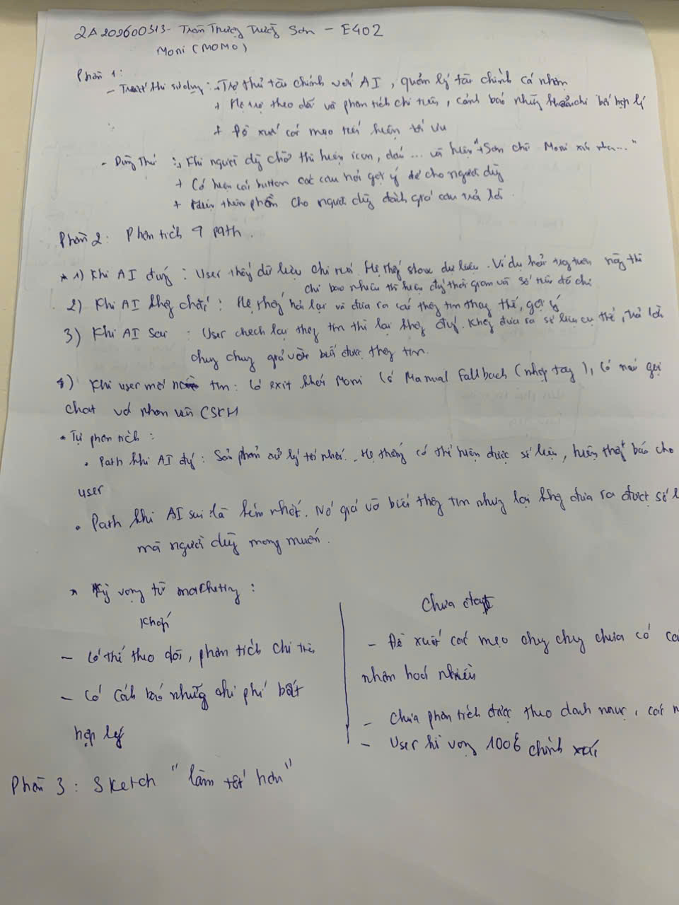
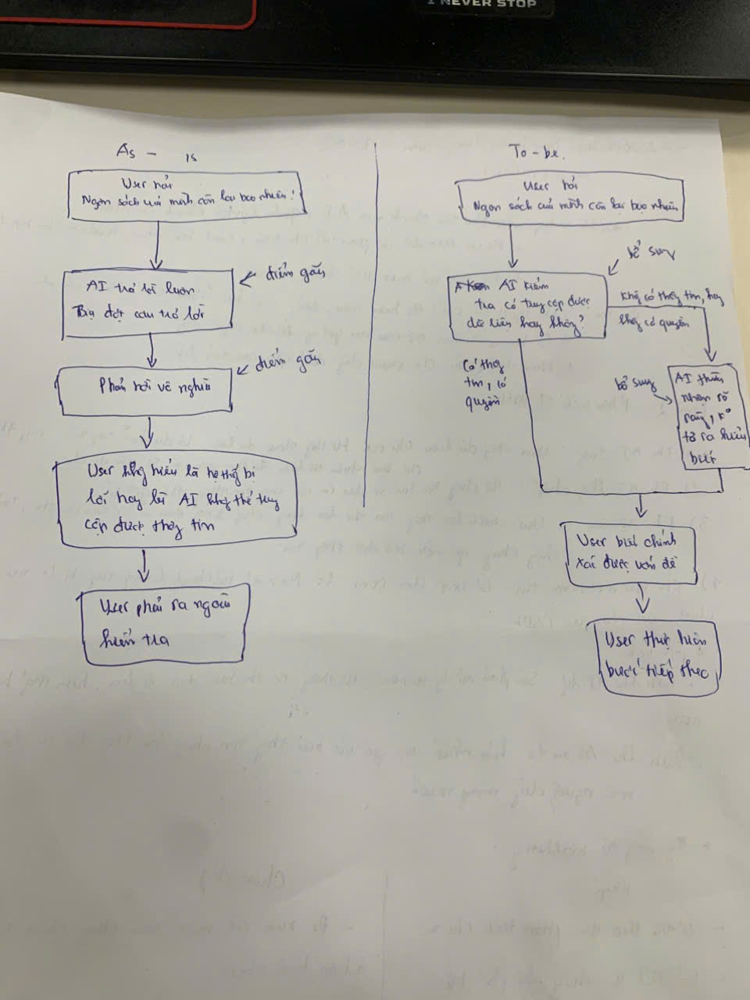
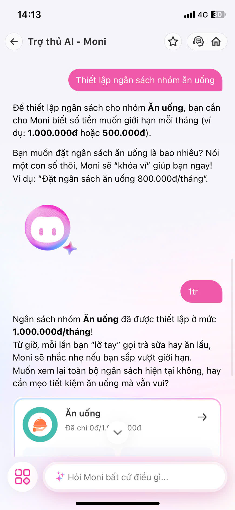
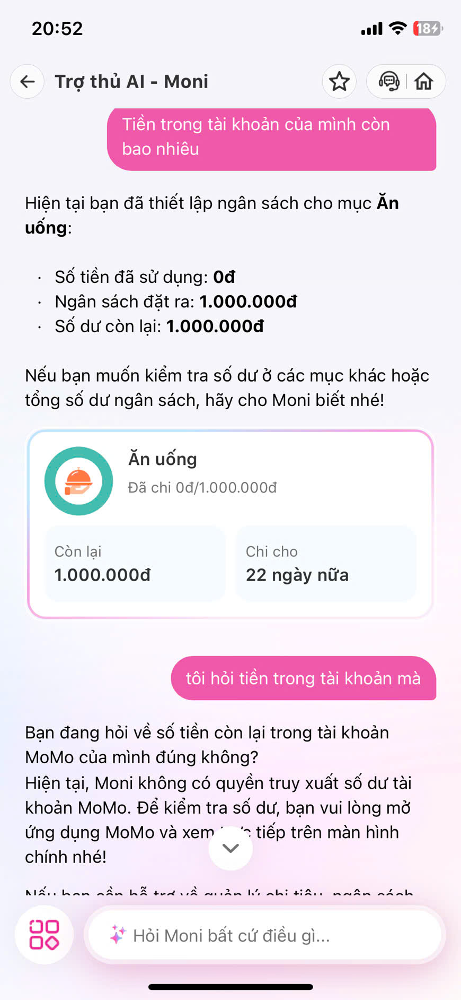

# Bài tập UX Day 05 — Phân tích sản phẩm AI thật

> **Sinh viên:** Trần Thường Trường Sơn — 2A202600313 — E402
>
> **Sản phẩm phân tích:** MoMo — Trợ thủ AI Moni

---

## Phần 1 — Khám phá

### Trước khi dùng (Marketing hứa gì?)

- Trợ thủ tài chính với AI, quản lý tài chính cá nhân
- Hệ thống theo dõi và phân tích chi tiêu, cảnh báo những chi phí bất hợp lý
- Đề xuất các mẹo tiết kiệm tối ưu

### Dùng thử (Thực tế ra sao?)

- Khi người dùng chào thì hiện icon, dấu… và hiện "Sẵn chỉ Moni nè bạn…"
- Có hiện các button câu hỏi gợi ý để cho người dùng
- Kèm thêm phần cho người dùng đánh giá câu trả lời (nút Có / Không)

---

## Phần 2 — Phân tích 4 Paths

| Path | Phân tích |
|------|-----------|
| **1. Khi AI đúng** | User thấy dữ liệu chi ra. Hệ thống store dữ liệu. Ví dụ hỏi "trong tuần này chi bao nhiêu" thì hiện đúng thời gian và số tiền đã chi. |
| **2. Khi AI không chắc** | Hệ thống hỏi lại và đưa ra các thông tin thay thế, gợi ý. |
| **3. Khi AI sai** | User check lại thông tin thì không đúng. Không đưa ra số liệu cụ thể, trả lời chung chung, giả vờ biết được thông tin. |
| **4. Khi user mất niềm tin** | Có exit khỏi Moni (có Manual fallback — nhập tay), có nút gọi chat với nhân viên CSKH. |

### Tự phân tích

- **Path tốt nhất — Khi AI đúng:** Sản phẩm xử lý tốt nhất. Hệ thống có thể hiện được số liệu, hiện thông báo cho user.
- **Path yếu nhất — Khi AI sai:** Nó giả vờ biết thông tin nhưng lại không đưa ra được số liệu mà người dùng mong muốn.

### Kỳ vọng từ marketing vs thực tế

| Khớp | Chưa được |
|------|-----------|
| Có thể theo dõi, phân tích chi tiêu | Đề xuất các mẹo chung chung, chưa có cá nhân hoá nhiều |
| Có cảnh báo những chi phí bất hợp lý | Chưa phân tích được theo danh mục cụ thể |
| | **Gap lớn nhất:** marketing không nói về khi AI sai — user kỳ vọng 100% chính xác |

---

## Phần 3 — Sketch "làm tốt hơn"

**Path yếu nhất được chọn:** Khi AI sai

### As-is (hiện tại) — Điểm gãy

1. User hỏi "Ngân sách của mình còn lại bao nhiêu?"
2. AI trả lời luôn, bậy đại câu trả lời ← **điểm gãy**
3. Phân tích vô nghĩa ← **điểm gãy**
4. User không hiểu là hệ thống bị lỗi hay AI không thể truy cập được thông tin
5. User phải ra ngoài kiểm tra

### To-be (đề xuất) — Cải thiện

1. User hỏi "Ngân sách của mình còn lại bao nhiêu?"
2. AI kiểm tra: có truy cập được dữ liệu hay không?
   - **Có thể tìm, có quyền** → Bổ sung dữ liệu → AI phản hồi chính xác → User biết chính xác vấn đề → User thực hiện bước tiếp theo
   - **Không thể tìm, hoặc không có quyền** → AI phản hồi nhận rõ rằng không có thông tin/không có quyền truy cập → User biết chính xác vấn đề → User thực hiện bước tiếp theo

**Thay đổi chính:** Thêm bước kiểm tra quyền truy cập dữ liệu trước khi trả lời, thay vì trả lời chung chung giả vờ biết.

### Sketch viết tay

| Sketch ghi chú phân tích | Sketch As-is vs To-be |
|:---:|:---:|
|  |  |

---

## Extras — Screenshot app MoMo (Moni)

### Khi AI đúng

Moni thiết lập ngân sách nhóm "Ăn uống" ở mức 1.000.000đ/tháng — đúng theo yêu cầu user.



### Khi AI sai

User hỏi "Ngân sách của mình còn lại bao nhiêu?" — Moni trả lời chung chung, không đưa ra con số cụ thể, chỉ nói "Xem chi tiết bên dưới nhé!" nhưng không hiện gì.


User hỏi "Tiền trong tài khoản của mình còn bao nhiêu" — Moni lúc đầu hiện thông tin ngân sách Ăn uống, sau đó thừa nhận không có quyền truy xuất số dư tài khoản MoMo.



---

## Cấu trúc thư mục

```
2A202600313_TranThuongTruongSon_Day05/
├── README.md                    # File này
├── ux-exercise/
│   ├── analysis.md              # Phân tích 4 paths (chi tiết)
│   ├── sketch_1.jpg             # Sketch ghi chú phân tích
│   └── sketch_2.jpg             # Sketch As-is vs To-be
└── extras/
    ├── path_AI_dung.jpg         # Screenshot khi AI đúng
    ├── path_AI_sai.jpg          # Screenshot khi AI sai (chung chung)
    └── path_AI_sai_1.jpg        # Screenshot khi AI sai (không có quyền)
```

---

*Bài tập UX — Ngày 5 — VinUni A20 — AI Thực Chiến · 2026*
